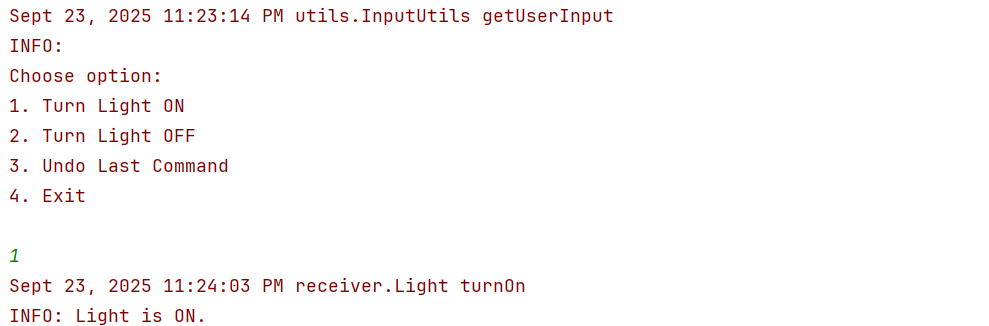
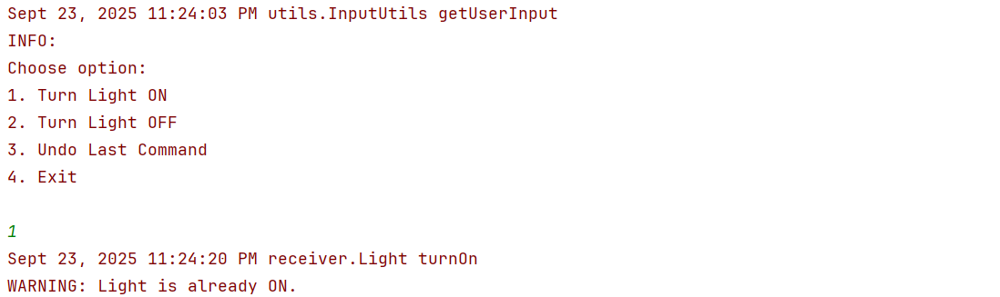
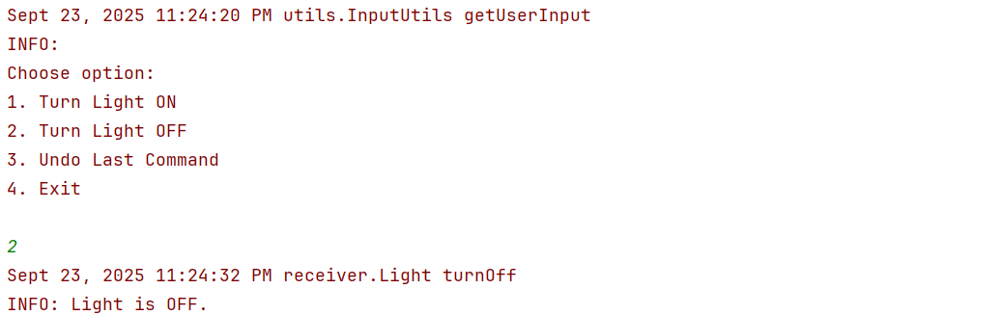
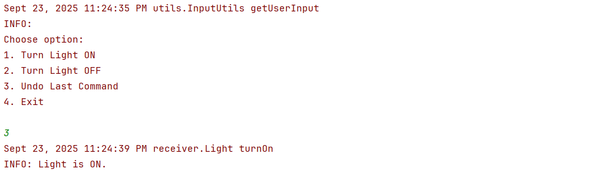
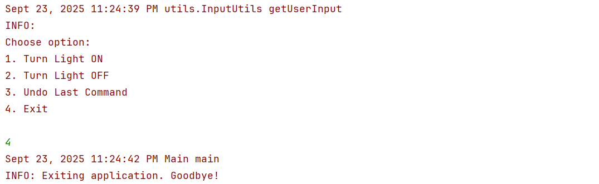

# Command Pattern – Remote Control

## 📖 Overview
This project demonstrates the **Command Design Pattern** in Java.  
The pattern encapsulates a request as an object, allowing:
- Parameterization of clients with different requests
- Queuing and logging of requests
- Support for undo operations

In this example, a **remote control** can turn a **Light ON/OFF** and also **undo the last action**.

---

## 🏗️ Structure
- **Command** → Interface with `execute()` and `undo()`
- **LightOnCommand / LightOffCommand** → Concrete command classes to control the Light
- **Light** → Receiver class performing actual ON/OFF operations
- **RemoteControl** → Invoker that executes and undoes commands
- **Main** → Client that interacts with the system through a simple menu

---

## 🖨️ Output Screenshots

- **Turn On Light** 

- **Clicking Turn On Light Again**

- **Turn Off Light**

- **Undo Operation**

- **Exiting**
