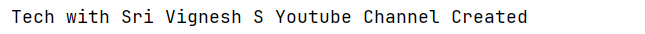
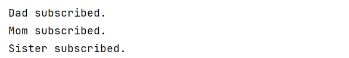
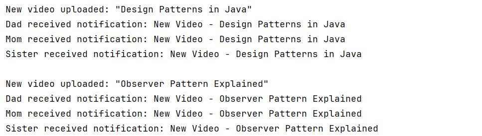
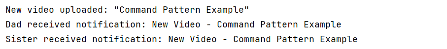

# Observer Pattern – YouTube Channel Notification

## 📖 Overview
This
project demonstrates the **Observer Design Pattern** in Java.  
The pattern defines a **one-to-many relationship** between objects so that when one object (subject) changes state, all its dependents (observers) are notified automatically.

In this example, a **YouTube Channel** notifies all its **Subscribers** whenever a new video is uploaded.

---

## 🏗️ Structure
- **Observer** → Interface with `update(String videoTitle)`
- **Subscriber** → Concrete observer representing a YouTube user
- **Subject** → Interface with methods to `subscribe()`, `unsubscribe()`, and `notifySubscribers()`
- **Channel** → Concrete subject representing a YouTube channel
- **Main** → Client to simulate channel upload and subscriber notifications

---

## 📜 Class Diagram

---

## 🖨️ Output Screenshots
- **Create a Youtube Channel**

- **Adding Subscribers**

- **Uploading Videos**

- **Unsubscribing**

- **Uploading New Videos**
