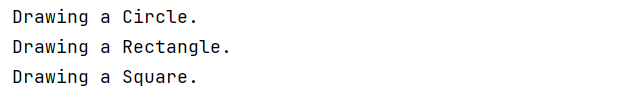

# Factory Method Pattern – Shape Factory

## Overview
This project demonstrates the **Factory Method design pattern** in Java using a **Shape Factory** example.  
Unlike the Simple Factory, the Factory Method Pattern relies on **subclasses** to decide which object to instantiate.

---

## Structure
- **Shape (Interface)**  
  Declares the `draw()` method.

- **Circle / Rectangle / Square (Concrete Products)**  
  Implement the `Shape` interface.

- **ShapeFactory (Creator – Abstract Class)**  
  Declares the abstract Factory Method `createShape()`.

- **CircleFactory / RectangleFactory / SquareFactory (Concrete Creators)**  
  Override the factory method to return their respective shapes.

- **Main (Client)**  
  Requests objects via the factories without knowing the exact class.

---

## Class Diagram

---

## Output Screenshots

