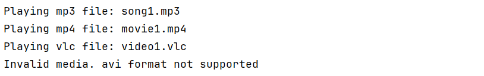

# Adapter Pattern – Media Player

## Overview
This project demonstrates the **Adapter design pattern** in Java using a **Media Player** example.  
The Adapter Pattern allows a class with an incompatible interface to work with others.  
Here, the `AudioPlayer` supports only **mp3**, but with the help of a `MediaAdapter`, it can also play **mp4** and **vlc**.

---

## Structure
- **MediaPlayer (Target Interface)**
    - Declares the `play()` method.

- **AdvancedMediaPlayer (Adaptee Interface)**
    - Defines specific methods `playVlc()` and `playMp4()`.

- **VlcPlayer / Mp4Player (Concrete Adaptees)**
    - Implement `AdvancedMediaPlayer`.

- **MediaAdapter (Adapter)**
    - Bridges `MediaPlayer` and `AdvancedMediaPlayer`.

- **AudioPlayer (Client)**
    - Uses the adapter to play multiple formats.

- **Main**
    - Demonstrates playing different audio types.

---

## Class Diagram

---

## Output Screenshots

