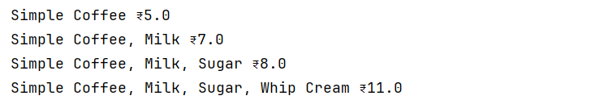

# Decorator Pattern – Coffee Shop

## Overview
This project demonstrates the **Decorator Design Pattern** in Java using a **Coffee Shop** example.  
The Decorator Pattern allows us to **add responsibilities to individual objects dynamically** without modifying their code.

In this example, a `SimpleCoffee` can be wrapped with multiple decorators like `Milk`, `Sugar`, and `WhipCream` to create different combinations of coffee.

---

## Structure

- **Coffee (Component Interface)**
    - Declares methods `getDescription()` and `getCost()`.

- **SimpleCoffee (Concrete Component)**
    - The base coffee with default description and cost.

- **CoffeeDecorator (Abstract Decorator)**
    - Implements `Coffee` and holds a reference to another `Coffee`.

- **MilkDecorator / SugarDecorator / WhipCreamDecorator (Concrete Decorators)**
    - Extend the functionality of the base coffee by adding their own description and cost.

- **Main**
    - Demonstrates different coffee combinations.

---

## Class Diagram

---

## Output Screenshot

