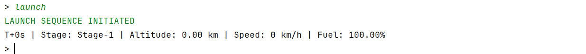

# Rocket Launch Simulator

## Problem Statement
The **Rocket Launch Simulator** is a Java-based console application simulating a Falcon 9 rocket launch, from pre-launch checks to orbit or failure. Users interact via commands to perform checks, launch, advance time, check status, or trigger failures, with telemetry (altitude, speed, fuel, mass) updated dynamically. The simulator ensures accurate state transitions and handles edge cases and manual failure scenarios (e.g., fuel depletion, engine shutdown).

---

## Features
- **Interactive Commands**: `start_checks`, `launch`, `fast_forward <seconds>`, `status`, `trigger_failure <type>`, `exit`.
- **State Transitions**: Pre-Launch, Ready, Stage-1, Stage-2, In-Orbit, Failed.
- **Failure Simulation**: Manual triggers for fuel burn, fuel capacity reduction, engine shutdown, and guidance errors.
- **Telemetry Display**: Altitude (km), speed (km/h), fuel (%), mass (kg) on demand.
- **Error Handling**: Manages invalid inputs and premature commands.

---

## Edge Cases Handled
- **Invalid Checklist Inputs**: Accepts only `checked`/`unchecked` during `start_checks`.
- **Incomplete Checks**: Blocks `launch` if any checklist item is `unchecked`.
- **Premature Commands**: Prevents `launch` or `fast_forward` in wrong states.
- **Invalid Commands**: Rejects unknown commands (e.g., `fast`).
- **Failure Triggers**: Rejects `trigger_failure` before mission start or with invalid types.
- **Failure Scenarios**: Fuel depletion, engine off, or guidance errors cause mission failure.

---

## Fuel Consumption Model

Total Initial Mass: 549,054 kg = 100%

| Phase | Fuel Consumed | Cumulative Fuel Used | Remaining Mass | Fuel Percentage |
|-------|---------------|---------------------|----------------|-----------------|
| **Liftoff** | 0 kg | 0 kg | 549,054 kg | **100.00%** |
| **Stage 1 Complete** | 411,000 kg | 411,000 kg | 138,054 kg | **25.13%** |
| **Stage 2 Complete** | 107,500 kg | 518,500 kg | 30,554 kg | **5.57%** |

---

## Design Patterns
- **Singleton**: `MissionControl` ensures a single instance.
- **State**: `RocketState` manages rocket lifecycle (Pre-Launch to Failed).
- **Command**: `Command` interface handles user inputs (`StartChecksCommand`, `TriggerFailureCommand`, etc.).
- **Strategy**: `PhysicsEngine` encapsulates dynamic telemetry calculations.

---

## File Structure
The project is organized to reflect its modular design:
```
RocketLaunchSimulator/
├── src/main/java/com/simulator/
   ├── Main.java
   ├── core/
   │   ├── MissionControl.java
   │   ├── Rocket.java
   │   ├── TelemetryData.java
   │   ├── TimeManager.java
   ├── states/
   │   ├── RocketState.java
   │   ├── PreLaunchState.java
   │   ├── ReadyForLaunchState.java
   │   ├── Stage1State.java
   │   ├── Stage2State.java
   │   ├── InOrbitState.java
   │   ├── FailedState.java
   ├── commands/
   │   ├── Command.java
   │   ├── StartChecksCommand.java
   │   ├── LaunchCommand.java
   │   ├── FastForwardCommand.java
   │   ├── StatusCommand.java
   │   ├── TriggerFailureCommand.java
   │   ├── CommandDispatcher.java
   ├── physics/
   │   ├── strategies/
   │   │   ├── StageUpdateStrategy.java
   │   │   ├── Stage1UpdateStrategy.java
   │   │   ├── Stage2UpdateStrategy.java
   │   ├── PhysicsEngine.java
   │   ├── RocketConstants.java
   ├── utils/
       ├── Logger.java
   
```

---

## Telemetry Values and References
- **Constants** (in `RocketConstants.java`):
    - `TOTAL_INITIAL_MASS`: 549,054 kg, `STAGE1_PROPELLANT_MASS`: 417,500 kg.
    - `STAGE2_INITIAL_MASS`: 138,054 kg, `STAGE2_PROPELLANT_MASS`: 107,500 kg.
- **References**:
    - [SpaceX Falcon 9](https://www.spacex.com/vehicles/falcon-9/).
    - [NASA Orbital Mechanics](https://www.nasa.gov/).

---

## Class Diagram 


---

## Output Screenshots

- **Available Commands**


- **Start Checks**


- **Launch**



- **Fast Forward**


- **Status**


- **Trigger Failure**


- **Exit**


